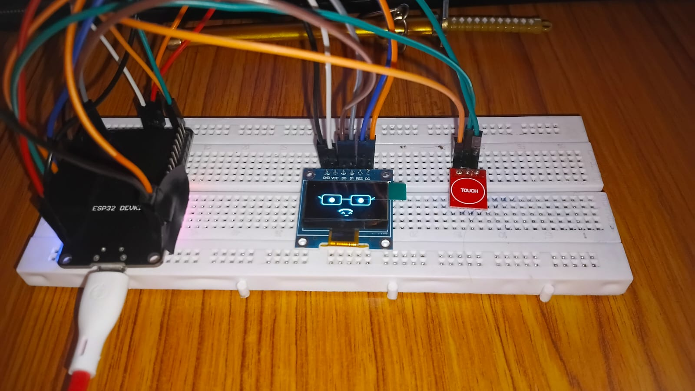

# ESP32 Smart Desk Bot

## Overview

ESP32 Smart Desk Bot is a mini interactive project built using an ESP32 DevKit V1, OLED display, and touch sensor. The bot can display 60 different animated faces and expressions, making it look alive and fun to use.

It can also show useful information such as:

* Current Time
* Temperature
* Weather Information
* Different Emotional Expressions

The touch sensor allows the user to switch between different screens and face animations.

---

## Features

* 60 animated face expressions
* OLED display animations
* Touch sensor control
* Weather display
* Time display
* Temperature display
* Cute robot-like face design
* Built using ESP32 DevKit V1

---

## Components Used

* ESP32 DevKit V1
* 0.96 inch OLED SPI Display
* Touch Sensor Module
* Breadboard
* Jumper Wires
* USB Cable

---

## Circuit Connections

### OLED Display to ESP32

| OLED Pin | ESP32 Pin |
| -------- | --------- |
| GND      | GND       |
| VCC      | 3.3V      |
| D0       | GPIO 18   |
| D1       | GPIO 23   |
| RES      | GPIO 16   |
| DC       | GPIO 17   |

### Touch Sensor to ESP32

| Touch Pin | ESP32 Pin |
| --------- | --------- |
| VCC       | 3.3V      |
| GND       | GND       |
| OUT       | GPIO 4    |

---

## Working

1. Power on the ESP32.
2. The OLED display shows an animated face.
3. Touch the sensor to change expressions.
4. The display can also show weather, time, and temperature.
5. Different faces appear one after another.

---

## Learning Outcome

This project helped in learning:

* ESP32 programming
* OLED SPI display connections
* Touch sensor interfacing
* Animation design
* Troubleshooting wiring issues
* Building interactive electronics projects

---

## Future Improvements

* Add WiFi support
* Add voice assistant features
* Add buzzer sound effects
* Add mini games
* Add mobile app control
* Add more face animations

---

## Author

Made by Mayank Biswas
